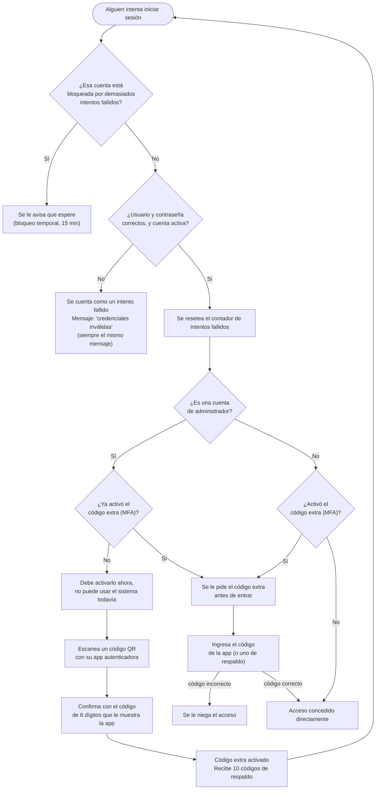
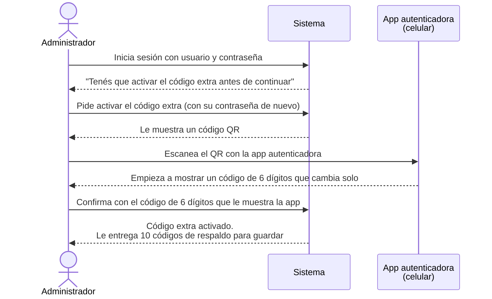
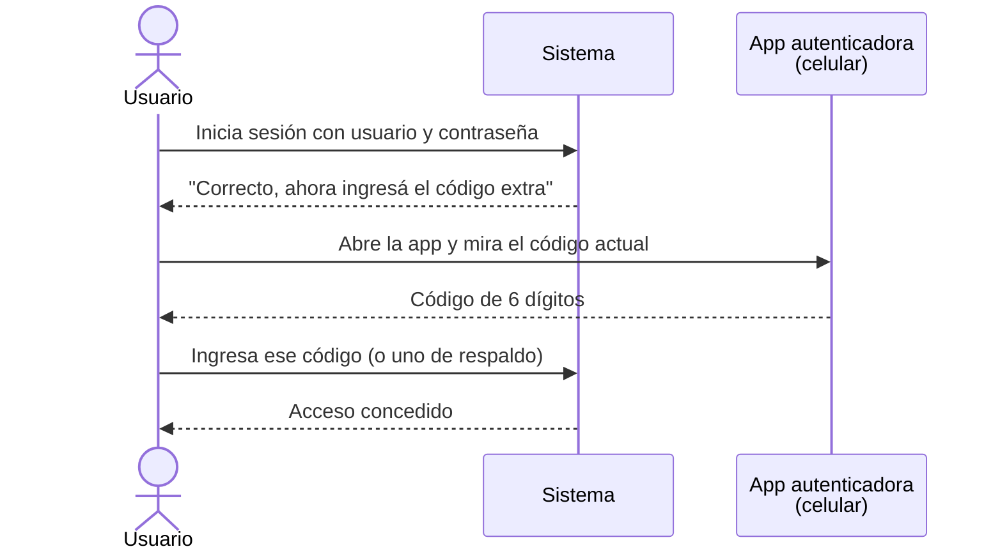

[⬅ Volver al índice](../README.md)

# Login y doble factor (MFA)

Esta página explica, de la forma más simple posible, cómo entra un usuario
al sistema y en qué casos se le pide un paso extra de seguridad (el
"doble factor" o MFA).

## ¿Qué pasa cuando alguien inicia sesión?

1. El usuario manda su usuario y contraseña.
2. El sistema revisa si esos datos son correctos y si la cuenta está
   activa. Si algo falla, siempre responde con el mismo mensaje genérico
   ("credenciales inválidas") — así nadie puede adivinar, por el mensaje de
   error, si el problema fue el usuario o la contraseña.
3. Si son correctos, hay tres posibilidades:
   - **Caso normal:** se le entrega el acceso directamente.
   - **La cuenta ya tiene activado el código extra (MFA):** se le pide ese
     código antes de entregarle el acceso.
   - **La cuenta es de un administrador y todavía no activó el código
     extra:** el sistema lo obliga a activarlo ahí mismo, antes de dejarlo
     hacer cualquier otra cosa. Para los administradores, el código extra
     no es opcional.
4. Si alguien se equivoca de contraseña demasiadas veces seguidas contra la
   misma cuenta, esa cuenta queda bloqueada temporalmente (15 minutos),
   para dificultar que alguien la "adivine" a fuerza de intentos.

No existe la posibilidad de que un usuario se registre solo: las cuentas
las crea únicamente un administrador.

## Diagrama: qué pasa al iniciar sesión

El siguiente diagrama muestra, paso a paso, todas las situaciones que
pueden darse al iniciar sesión: el bloqueo por intentos fallidos, el
mensaje de error genérico, y las tres salidas posibles (acceso directo,
pedir el código extra, u obligar a activarlo primero).

## El doble factor (MFA): ¿qué es y cuándo se pide?

El doble factor es un código de 6 dígitos que cambia cada 30 segundos,
generado por una aplicación en el celular (Google Authenticator, Authy, o
similar). Sirve para que, aunque alguien consiga la contraseña de una
cuenta, no pueda entrar sin tener también el celular donde está esa
aplicación.

- **Para administradores es obligatorio.** Un admin no puede usar el
  sistema hasta activarlo.
- **Para el resto de los usuarios es opcional.** Lo pueden activar si
  quieren un nivel extra de seguridad.

Esto no es solo una sugerencia en la pantalla de login: el sistema lo
aplica técnicamente, de forma que sea imposible saltearlo (el detalle de
cómo se garantiza esto está en [Seguridad implementada](05-seguridad.md)).

### Diagrama: activar el código extra por primera vez

Este diagrama muestra los pasos que sigue, en orden, un administrador que
recién inicia sesión y todavía no tiene el código extra activado.

> Guardá esos 10 códigos de respaldo en un lugar seguro: sirven para entrar
> si en algún momento perdés el celular con la app autenticadora. Cada uno
> se puede usar una sola vez.

### Diagrama: iniciar sesión con el código extra ya activado

Una vez activado, cada inicio de sesión pide un paso adicional.

## Desactivar el código extra

Desactivarlo requiere confirmar la contraseña **y** un código vigente (no
es un simple interruptor que se apaga con un clic) — así nadie que solo
haya robado la sesión abierta puede desactivarlo. Las cuentas de
administrador **no pueden desactivarlo nunca**: es obligatorio mientras el
usuario mantenga ese rol.

## Códigos de respaldo

Se generan 10 al activar el código extra, se muestran una única vez en el
momento y después no se pueden volver a ver — hay que guardarlos apenas se
generan. Cada uno funciona una sola vez. Si se vuelve a activar el código
extra más adelante, se generan 10 nuevos y los anteriores dejan de servir.

## Limitaciones que hay que tener presentes

- El código extra protege el momento de iniciar sesión. Si una sesión ya
  abierta es robada (por ejemplo, robando el token desde el navegador), el
  código extra no ayuda ahí — para eso están la posibilidad de cerrar
  sesión remotamente y la corta duración de las sesiones.
- Es vulnerable a un ataque de "phishing en tiempo real" (un sitio falso
  que le pide el código a la víctima y lo reenvía al sitio real en el
  momento). El único mecanismo realmente resistente a esto son las
  passkeys (WebAuthn), que no están implementadas en este template.

## Endpoints relacionados

| Método | Ruta | Qué hace |
|--------|------|----------|
| POST | `/api/auth/login` | Inicia sesión |
| POST | `/api/auth/mfa/enable` | Empieza a activar el código extra |
| POST | `/api/auth/mfa/confirm` | Confirma la activación con un código |
| POST | `/api/auth/mfa/verify` | Segundo paso del login cuando el código extra ya está activo |
| POST | `/api/auth/mfa/disable` | Desactiva el código extra |

El detalle técnico de cada uno (qué mandar, qué devuelve, qué códigos de
error puede dar) está en [Referencia de endpoints](08-endpoints.md) y en la
documentación interactiva ([Swagger](03-documentacion-api.md)).

---

[⬅ Volver al índice](../README.md) · Anterior: [Documentación de la API](03-documentacion-api.md) · Siguiente: [Seguridad implementada](05-seguridad.md)
