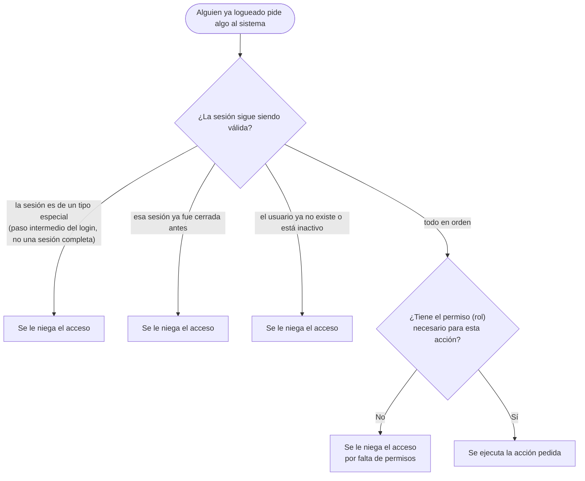
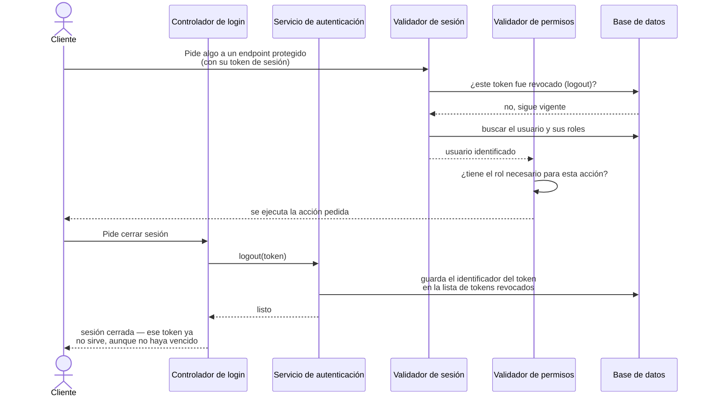

[⬅ Volver al índice](../README.md)

# Seguridad implementada

## Resumen, sin tecnicismos

Este sistema fue diseñado pensando en varias formas típicas de ataque, y
para cada una tiene una defensa concreta:

- **Si alguien intenta adivinar una contraseña a fuerza de intentos**, el
  sistema lo frena (bloqueo por intentos fallidos + límite de intentos por
  minuto).
- **Si alguien roba una contraseña**, no le alcanza para entrar a una
  cuenta de administrador: hace falta además el código extra del celular
  (MFA).
- **Si alguien roba una sesión ya abierta** (el "token" que queda guardado
  en el navegador), se le puede cortar el acceso al instante cerrando esa
  sesión de forma remota, y las sesiones vencen solas al rato.
- **Si alguien mira directamente la base de datos**, no encuentra
  contraseñas ni códigos secretos en texto plano: todo lo sensible está
  encriptado o convertido en un formato que no se puede revertir.
- **Si algo sale mal**, queda registrado quién hizo qué y cuándo, para
  poder investigarlo después.

El resto de esta página detalla, mecanismo por mecanismo, cómo funciona
cada una de estas protecciones y en qué archivo del código está
implementada — pensado para quien vaya a mantener o auditar el proyecto.

## Tabla maestra de seguridad

### Autenticación

| Mecanismo | Cómo funciona | Dónde |
|-----------|----------------|-------|
| Hashing de contraseñas | `bcrypt` (10 rounds), nunca se guarda ni se loguea en texto plano | `users.service.ts`, `mfa.service.ts`, `seed.service.ts` |
| Contraseña no recuperable por query normal | Columna `password` con `select: false`; hay que pedirla explícitamente (`addSelect`/`select` en el `findOne`) | `users/entities/user.entity.ts` |
| Política de contraseña única y compartida | Mínimo 6 caracteres, mayúscula, minúscula y número o símbolo — una sola regex reutilizada por todos los DTOs que reciben contraseña | `common/constants/password.constants.ts` |
| Anti enumeración de usuarios | Login devuelve siempre el mismo error (`Invalid credentials`) exista o no el userName; si el usuario no existe se compara igual contra un hash "señuelo" precalculado, para que el tiempo de respuesta no delate la diferencia (mitigación de timing attack) | `auth.service.ts` (`dummyPasswordHash`, `login()`) |
| JWT stateless con identificador único | Cada token lleva un `jti` (uuid) además del `id` del usuario; se firma con HS256 | `auth/interfaces/jwt-payload.interface.ts`, `auth.module.ts` |
| Secreto de firma validado al arrancar | La app rechaza levantar si `JWT_SECRET` mide menos de 32 caracteres o es el placeholder del `.env.example` (fail-fast) | `auth/strategies/jwt.strategy.ts` |
| Revocación de tokens (logout real) | El `jti` del token se guarda en `revoked_tokens`; `JwtStrategy` lo rechaza en cada request aunque el token no haya expirado | `auth/entities/revoked-token.entity.ts`, `auth.service.ts` (`logout`), `auth/strategies/jwt.strategy.ts` (`validate`) |
| Rotación de tokens | `GET /auth/check-status` revoca el token con el que se llamó y entrega uno nuevo — un token robado no se puede seguir renovando en paralelo con el legítimo | `auth.service.ts` (`checkAuthStatus`) |
| Sin registro público | No existe endpoint para auto-registrarse; los usuarios los crea únicamente un admin autenticado | `auth.controller.ts` (no tiene `/register`), `users.controller.ts` (`@Auth(admin)`) |

### Autorización (control de acceso por rol)

| Mecanismo | Cómo funciona | Dónde |
|-----------|----------------|-------|
| Guard de roles | Lee los roles requeridos del endpoint (metadata) y los compara contra los roles reales del usuario autenticado | `auth/guards/user-role/user-role.guard.ts` |
| Decorador `@Auth(...roles)` | Combina en un solo paso: exigir sesión válida (`AuthGuard('jwt')`) + verificar rol (`UserRoleGuard`) | `auth/decorators/auth.decorator.ts` |
| Protección del último admin | No se puede desactivar al único usuario `admin` activo del sistema | `users/services/user-roles.service.ts` (`validateCanDeactivateUser`) |
| El rol admin no se asigna por API | `assignRole` rechaza explícitamente asignar el rol `admin` (solo existe vía seed o acceso directo a la DB) | `users/services/user-roles.service.ts` (`assignRole`) |

### MFA (doble factor)

| Mecanismo | Cómo funciona | Dónde |
|-----------|----------------|-------|
| Obligatorio para admin, opcional para el resto | Se decide en el login según el rol y si ya está activado | `auth.service.ts` (`login`) |
| Enforcement real (no de UI) | Tokens de alcance limitado (`scope: 'mfa_setup' \| 'mfa_verify'`) que `JwtStrategy` rechaza en **cualquier** endpoint protegido normal; solo el controlador de MFA los acepta, validándolos a mano contra la lista explícita de casos permitidos | `auth/interfaces/jwt-payload.interface.ts`, `auth/strategies/jwt.strategy.ts`, `auth.service.ts` (`resolveUserFromToken`, `getScopedToken`) |
| Alta protegida con contraseña | Activar el MFA exige la contraseña de la cuenta además del token — un token de sesión robado no alcanza para inscribir un secreto ajeno y bloquear al dueño real | `auth/mfa/mfa.service.ts` (`startEnrollment`), `auth/mfa/dto/enable-mfa.dto.ts` |
| Secreto cifrado en reposo | AES-256-GCM con clave fuera de la base (`MFA_ENCRYPTION_KEY`, variable de entorno); columna `mfaSecret` con `select: false` | `common/utils/crypto.util.ts`, `users/entities/user.entity.ts` |
| Códigos de respaldo de un solo uso | 10 códigos generados al confirmar el alta, hasheados con bcrypt (igual que una contraseña), consumo atómico (`UPDATE ... WHERE usedAt IS NULL`) para que dos pedidos simultáneos no puedan gastar el mismo código dos veces | `auth/mfa/mfa.service.ts` (`generateBackupCodes`, `consumeBackupCode`), `auth/entities/mfa-backup-code.entity.ts` |
| No se puede desactivar en cuentas admin | `disable()` lanza error si el usuario tiene rol admin, sin excepción | `auth/mfa/mfa.service.ts` (`disable`) |
| Desactivar requiere doble prueba | Password + código vigente (TOTP o de respaldo), nunca un simple interruptor | `auth/mfa/mfa.service.ts` (`disable`) |

Más detalle de cómo se usa en la práctica: [Login y doble factor (MFA)](04-login-mfa.md).

### Anti fuerza bruta y abuso

| Mecanismo | Cómo funciona | Dónde |
|-----------|----------------|-------|
| Límite global por IP | 20 pedidos por minuto en todos los endpoints | `app.module.ts` (`ThrottlerModule` + `APP_GUARD`) |
| Límite reforzado en endpoints sensibles | 5 pedidos por minuto en login y en los 4 endpoints de MFA | `auth.controller.ts`, `auth/mfa/mfa.controller.ts` (`@Throttle`) |
| Bloqueo por cuenta e IP | 5 fallos de login en 15 minutos desde la misma IP bloquean esa combinación (cuenta + IP) 15 minutos. Atarlo a la IP evita que un atacante bloquee al admin real desde otra dirección | `auth/login-throttle.service.ts`, usado desde `auth.service.ts` (`login`) |
| Límite de intentos de MFA por usuario | 5 códigos incorrectos (TOTP o de respaldo) en 15 minutos bloquean los intentos de ese usuario 15 minutos desde cualquier IP, y el `mfaToken` en uso se revoca. Los fallos de contraseña se limpian recién cuando el MFA también pasa | `auth/mfa/mfa.controller.ts` (`verify`), `auth.service.ts` (`clearPasswordFailures`) |
| Código TOTP de un solo uso | Se recuerda el último paso TOTP aceptado por usuario (en memoria) y se rechaza un código de ese paso o de uno anterior | `auth/mfa/mfa.service.ts` (`verifyTotp`) |
| IP real detrás de proxy/PaaS | `TRUST_PROXY` configurable para que el límite por IP no colapse (o sea evadible) cuando la app corre detrás de Railway/Render/Cloudflare/nginx | `main.ts` |

> **En números:** login está limitado a 5 intentos por minuto por dirección
> IP (el resto de endpoints usa el límite global de 20/min), y además a 5
> fallos cada 15 minutos por cuenta e IP (así nadie puede bloquear a un
> usuario ajeno desde otra dirección), más 5 códigos MFA incorrectos por
> usuario, sin importar la IP. Estos contadores viven en la memoria del
> proceso: si se corren varias instancias detrás de un balanceador de
> carga, cada una cuenta por separado (para un límite realmente global
> haría falta un almacenamiento compartido como Redis).

### Protección de la app y los datos

| Mecanismo | Cómo funciona | Dónde |
|-----------|----------------|-------|
| Cabeceras HTTP seguras | `helmet()` (CSP, HSTS, X-Frame-Options, etc.) | `main.ts` |
| CORS restringido | Whitelist de orígenes configurable por variable de entorno, en vez de aceptar cualquiera | `main.ts` (`CORS_ORIGINS`) |
| Validación estricta de entrada | `ValidationPipe` global: descarta campos no declarados y rechaza el pedido si vienen campos extra | `main.ts` |
| Sin inyección SQL | Todo el acceso a datos usa el ORM con parámetros bindeados; no hay concatenación de texto con datos ingresados por el usuario en ninguna consulta | todos los `*.service.ts` |
| Esquema de base de datos versionado | El esquema se gestiona con migraciones; el modo "auto-sincronizar" está apagado salvo que se fuerce explícitamente, y solo para desarrollo local | `app.module.ts`, `src/migrations/` |
| Seed no reutilizable con credenciales públicas | Las contraseñas de prueba del `.env.example` son públicas (están en el repo); en producción la app se niega a crear usuarios de prueba si siguen siendo esas | `seed/seed.service.ts` |
| Cierre limpio del proceso | Al apagar el servidor (por ejemplo durante un despliegue), se frenan las tareas programadas y se cierran las conexiones a la base de forma ordenada | `main.ts` |
| Documentación apagada por defecto | La documentación interactiva solo se activa con `SWAGGER_ENABLED=true`, para no publicar el mapa completo de la API por olvido | `main.ts` (`SWAGGER_ENABLED`) |

### Trazabilidad

| Mecanismo | Cómo funciona | Dónde |
|-----------|----------------|-------|
| Auditoría de acciones sensibles | Alta/baja/reseteo de usuarios, asignación de roles y alta/baja de MFA quedan registrados con quién, qué, sobre qué y cuándo | `audit/` — ver [Auditoría y retención de datos](07-auditoria-retencion.md) |
| Retención automática | Sesiones cerradas viejas y registros de auditoría viejos se eliminan solos, con un tiempo configurable | `maintenance/retention.service.ts` — ver [Auditoría y retención de datos](07-auditoria-retencion.md) |

## Cómo se protege un endpoint (detalle técnico)

Cada vez que alguien ya logueado pide algo al sistema (ver un dato, crear
algo, modificar algo), ese pedido pasa por dos controles antes de
ejecutarse: primero se revisa que la sesión siga siendo válida, y después
que el usuario tenga el permiso (rol) necesario para esa acción puntual.

### Diagrama: qué controles pasa un pedido antes de ejecutarse

### Diagrama de secuencia: acceso a una ruta protegida y cierre de sesión

Este diagrama muestra, con más detalle técnico, qué pasa "por dentro"
cuando un usuario ya logueado pide algo, y qué pasa cuando cierra sesión.

## Componentes principales (referencia para desarrolladores)

#### 1. `JwtStrategy` (`src/auth/strategies/jwt.strategy.ts`)
Extiende `PassportStrategy(Strategy)`. Valida cada request autenticado:
- Extrae el token del header `Authorization: Bearer <token>`
- Decodifica el payload `{ id, jti }`
- Rechaza el token si su `jti` está en `revoked_tokens` (logout)
- Busca el usuario en la DB con sus roles relacionados
- Verifica que el usuario exista y esté activo (`isActive: true`)
- Retorna el `User` completo → queda disponible en `request.user`

#### 2. `UserRoleGuard` (`src/auth/guards/user-role/user-role.guard.ts`)
Guard personalizado que:
- Lee los roles requeridos del metadata del endpoint (vía `Reflector`)
- Si no hay roles definidos, permite el acceso (solo requiere estar autenticado)
- Itera sobre `user.userRoles` y verifica si alguno coincide con los roles requeridos
- Lanza `ForbiddenException` si el usuario no tiene el rol necesario

#### 3. Decorador `@Auth(...roles)` (`src/auth/decorators/auth.decorator.ts`)
Decorador combinado que aplica en un solo paso:
1. `@RoleProtected(...roles)` - establece los roles en metadata
2. `@UseGuards(AuthGuard('jwt'), UserRoleGuard)` - activa ambos guards

#### 4. `@RoleProtected(...roles)` (`src/auth/decorators/role-protected.decorator.ts`)
Usa `@SetMetadata(META_ROLES, roles)` para registrar los roles requeridos
en los metadatos del endpoint. El `UserRoleGuard` los lee con `Reflector`.

#### 5. `@GetUser(field?)` (`src/auth/decorators/get-user.decorator.ts`)
Decorator de parámetro que extrae el usuario del request:
- `@GetUser()` → objeto `User` completo
- `@GetUser('userName')` → solo el campo indicado

Cómo aplicar todo esto en un endpoint propio: [Guía para extender el proyecto](09-guia-desarrollo.md).

---

[⬅ Volver al índice](../README.md) · Anterior: [Login y doble factor (MFA)](04-login-mfa.md) · Siguiente: [Roles y permisos](06-roles-permisos.md)
